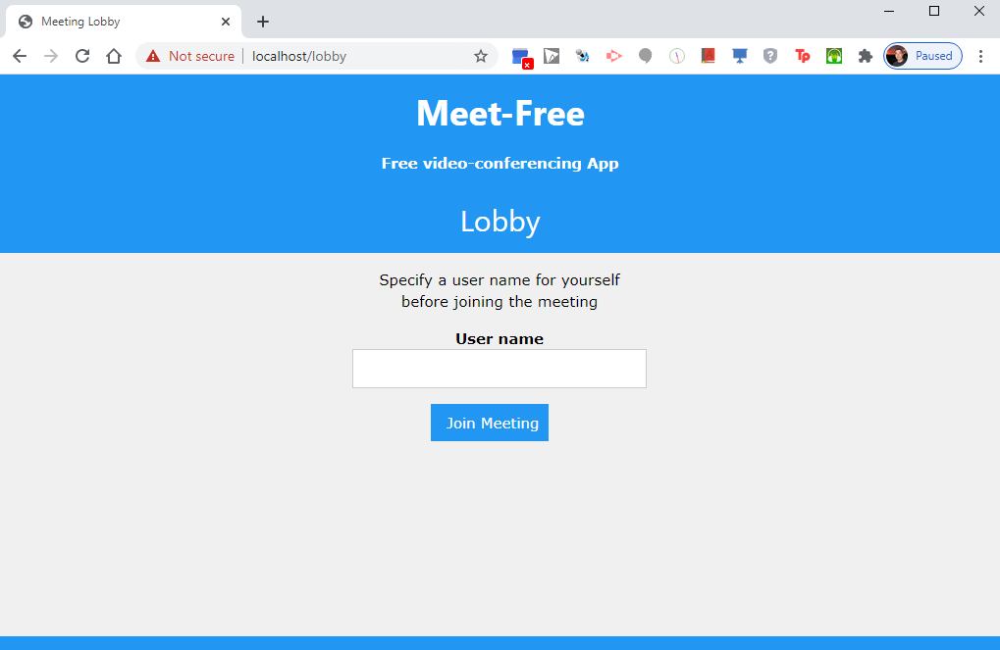
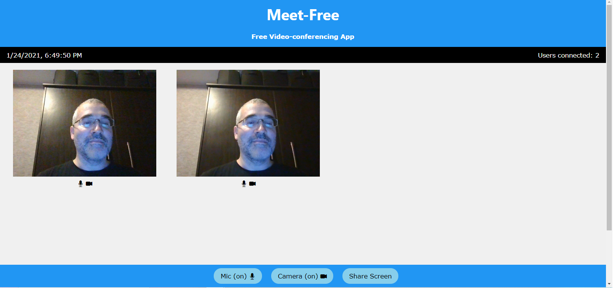
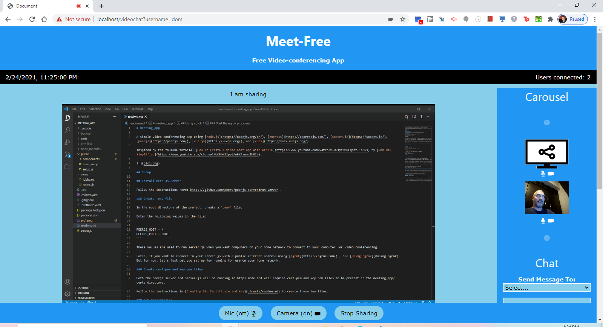
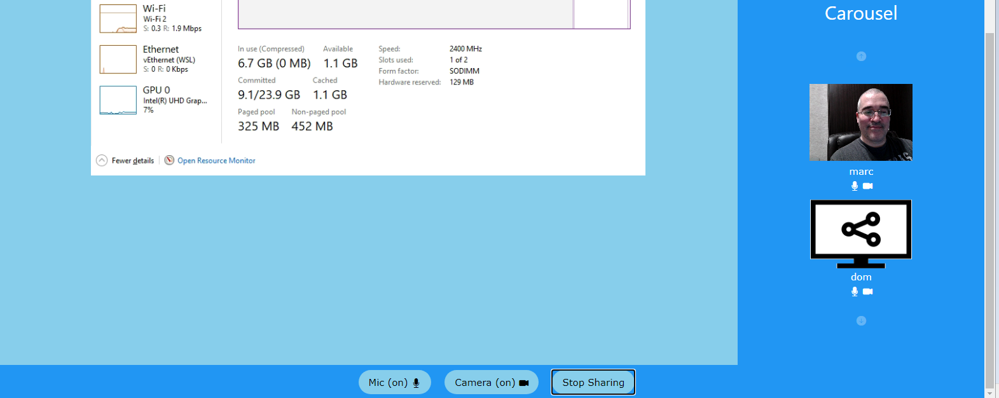

# meeting_app

A simple video conferencing app using [node.js](https://nodejs.org/en/), [express](https://expressjs.com/), [socket.io](https://socket.io/), [peerjs](https://peerjs.com/), [vue.js](https://vuejs.org/), and [vuex](https://vuex.vuejs.org/).

Inspired by the YouTube tutorial [How To Create A Video Chat App With WebRTC](https://www.youtube.com/watch?v=DvlyzDZDEq4&t=1466s) by [Web Dev Simplified](https://www.youtube.com/channel/UCFbNIlppjAuEX4znoulh0Cw).






## Setup

## Install Peer JS Server

Follow the instructions here: https://github.com/peers/peerjs-server#run-server .

### Create .env file

In the `env_files\local` directory of the project, create a `.env` file.

Enter the following values in the file:

```
PEERJS_HOST=/
PEERJS_PORT=3002
HTTPS_MODE=true
SERVER_PORT=3001
```

These values are used to run server.js when you want computers on your home network to connect to your computer for video conferencing.

Later, if you want to connect to your server.js with a public internet address using [ngrok](https://ngrok.com/) , see [Using ngrok](#using-ngrok). But for now, let's just get you set up for running for use on your home network.

### Create cert.pem and key.pem files

Both the peerjs server and server.js will be running in https mode and will require cert.pem and key.pem files.

Put a cert.pem and key.pem in the `certs\peerjs` directory for the peerjs server.

Put a cert.pem and key.pem in the `certs` directory for the server.js server.

Follow the instructions in [Creating SSL Certificate and Key](./certs/readme.md) to create these files.

### Get Dependencies

In the meeting_app directory, type:

```sh
npm install
```

### Start the peerjs server

In a windows command window, in the meeting_app directory:

```sh
npm run start-peerjs-local
```

`start-peerjs-local` is defined in the scripts section of the package.json

(It starts the peerjs server in https mode and uses the cert.pem and key.pem)

### Start server.js

To start the main file, server.js :

```sh
npm run start-local
```

(`setenv_local.bat` is called before starting the server. This bat file deletes
the `.env` in the main directory, and copies `env_files/local/.env` into the main directory.)

### Open the web app in the browser

In your browser, navigate to `https://localhost:3002` .

- You will need to accept the certificate warning. On Chrome, there should be an Advanced twistie that you can open and then select `Proceed`.

In your browser, navigate to `https://localhost:3001` .

- You will need to accept the certificate warning. On Chrome, there should be an Advanced twistie that you can open and then select `Proceed`.
- You will end up in the Lobby. Type a user name for yourself and press the [Join Meeting] button
- You will need to click on the Allow button so that browser can use the webcam and microphone.

Find out your machine IP address on your internal network, and then, from another computer (or open another normal or private browser window), repeating the same steps above. Careful, you will get microphone feedback ;)

## Using ngrok

To connect to your server.js and peerjs server from a public internet address, you can use [ngrok](https://ngrok.com/) to create tunnels from the ngrok domains (you created in your ngrok account) to the port running your server.js and the port running your peerjs server on your computer.

I created two domains in ngrok; each had a unique/generated url

I had an actual website already, e.g. www.myhost.com . I went in to the DNS Zone of the control panel of my website, and created two CNAME records.

- subdomain1 with a value of a generated ngrok domain url provided for this domain.
- subdomain2 with a value of a generated ngrok domain url provided for this domain.

Since your are running two servers on your machine, you need to start two ngrok processes; each in their own command window
I bought an ngrok account where I could have 2 processes, and they provided TLS certificates for both ngrok domains I set up in that account.

When the TLS certificates are set up for the ngrok domains, there is no need to
use https mode nor (cert.pem, key.pem) on the two local processes running on your laptop.

### Create a new .env file

In `env_files\public` create a new `.env` file.

Fill it with these values.

```
PEERJS_HOST=subdomain2.yourhost.com
HTTPS_MODE=false
SERVER_PORT=3001
```

where subdomain2 is the CNAME you defined in the DNS section of your website domain (yourhost.com).

There is no need to specify PEERJS_PORT; otherwise the front end, defined in room.ejs, will not be able to connect to peerjs. Not sure why.

### Start Peerjs server (without https)

```sh
npm run start-peerjs-public
```

### Edit start_ngrok_tunnel_peerjs_server.bat

Modify `start_ngrok_tunnel_peerjs_server.bat` to contain your
subdomain2.yourhost.com.

(Where subdomain2 is defined in your ngrok account and has a TLS certificate provided by ngrok.)

### Start the ngrok tunnel for Peerjs server

Start an ngrok tunnel for the peerjs server port:

```sh
npm run start-ngrok-tunnel-peerjs
```

### Start server.js (without https)

```sh
npm run start-public
```

(`setenv_public.bat` is called before starting the server. This bat file deletes
the `.env` in the main directory, and copies `env_files/public/.env` into the main directory.)

### Edit start_ngrok_tunnel_server.bat

Modify `start_ngrok_tunnel_server.bat` to contain your
subdomain1.yourhost.com.

(Where subdomain1 is defined in your ngrok account and has a TLS certificate provided by ngrok.)

### Start the ngrok tunnel for server.js

Start an ngrok tunnel for the server.js port:

```sh
start-ngrok-tunnel-server
```

### Open the web app in the browser

Now, since the TLS certificates are in place in your ngrok account, you only need to open
the main url in a browser:

```sh
https://subdomain1.yourhost.com
```

You will be brought to the Lobby.
Enter a user name for yourself
Press [Join Meeting]

Allow access to the camera and microphone

(There are no certificate warning messages. Yay!)
